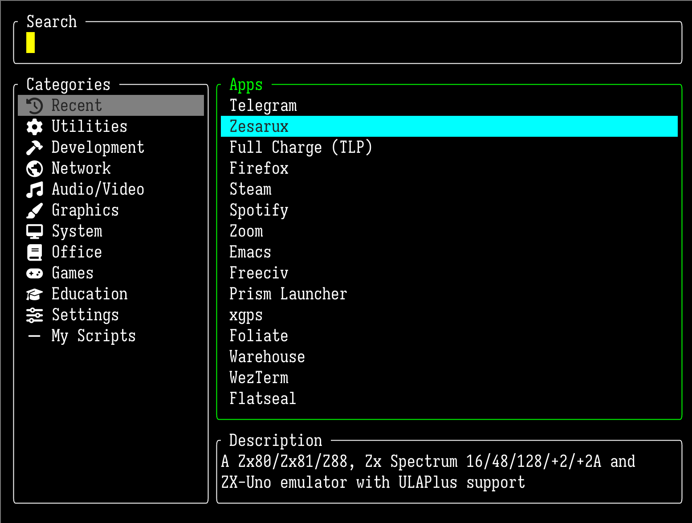

<h1 align="center">bstl</h1>

<p align="center"><b>Bazza's Simple TUI Launcher</b> — a fast, keyboard-driven application launcher for the terminal.</p>

<p align="center"></p>

> **Fork notice.** `bstl` is a fork of [dstl](https://github.com/saltnpepper97/dstl) ("Dustin's Simple TUI Launcher") by saltnpepper97. The upstream project is no longer actively maintained and this fork has diverged substantially in behaviour, internal layout, and configuration. The original MIT licence and copyright are preserved (see `LICENSE`).

## Highlights

- 🏢 **Sway integration** — execution via `swayexec` IPC (avoids the launcher being parent of the launched process), and smart fullscreen handling (un-fullscreens on launch, restores on cancel).
- 🔄 **Toggle-able** — a second invocation sends a quit signal over a Unix socket, so a single keybinding opens and closes the launcher.
- ⌨️ **Stateless UX** — typing always goes to search, arrow keys always navigate. No focus modes to remember.
- 🖱️ **Mouse support** — click to select / launch, scroll wheel to navigate the list under the cursor.
- 📝 **Description pane** — the `Comment=` field from each `.desktop` entry is shown below the apps list so you can see what an unfamiliar app actually does before launching it.
- 🎹 **Emacs keybindings** — GNU Readline-style shortcuts (`Ctrl-a`, `Ctrl-e`, `Ctrl-k`, `Ctrl-u`, …).
- 📊 **Launch history & popularity ranking**  — every launch is recorded; frequently-used apps win search ties and lead the default view.
- 🗄️ **SQLite-backed cache** — `.desktop` files are parsed once and cached; an mtime check on each XDG directory makes the steady-state startup near-free.
- 🎨 **Highly themable** — extensive theming via a single `bstl.toml` file with hex colours, border styles, cursor shapes, etc.

## Installation

### From source

```bash
git clone <this repo>
cd bstl
cargo build --release
sudo cp target/release/bstl /usr/local/bin/
```

### Migrating from `dstl`

If you previously had `dstl` installed:
- Launch history is preserved: `~/.local/share/dstl/dstl.sqlite` is moved to `~/.local/share/bstl/bstl.sqlite` on first run if the new path doesn't exist. The old `~/.cache/dstl/recent.json` MRU file (if present) is folded into the new launches table on first DB creation.
- The old `dstl.rune` config format is **no longer supported**. `bstl` now uses TOML — copy `examples/bstl.toml` to `~/.config/bstl/bstl.toml` and re-enter your settings. If a `dstl.rune` or `bstl.rune` file is found at startup, `bstl` prints a one-line warning and otherwise ignores it.

## Configuration

`bstl` looks for configuration in (in order):
1. `~/.config/bstl/bstl.toml`
2. `/usr/share/doc/bstl/bstl.toml`

A complete example lives in `examples/bstl.toml`. Every field is optional — anything you omit falls back to the built-in default — so a one-line `terminal = "wezterm start"` is a perfectly valid config.

### Minimal example

```toml
dmenu = false
search_position = "top"      # or "bottom"
start_mode = "single"        # or "dual"

sway = true
print_selection = false
terminal = "foot"

# Launch history / popularity (see "Launch history" section below)
recent_first = true
top_recent_count = 5
history_window_days = 90
popularity_weight = 10
max_recent_apps = 15

[theme]
border = "#ffffff"
focus = "#00ff00"
unfocused = "#808080"
highlight = "#0000ff"
cursor_color = "#00ff00"
cursor_shape = "block"          # block | underline | pipe
cursor_blink_interval = 500     # ms, 0 to disable
border_style = "rounded"        # plain | rounded | thick | double
highlight_type = "background"   # background | foreground
```

## Launch history

`bstl` records every launch (timestamp + app name) into a SQLite database at `~/.local/share/bstl/bstl.sqlite`. This drives two features:

**Default-view top-N.** With `recent_first = true`, the empty-query view leads with the `top_recent_count` (default 5) most-launched apps within the trailing `history_window_days` window (default 90), followed by the rest of the alphabetical list. So your daily-drivers are always one keystroke away.

**Search popularity bias.** When two apps both match a query, the one you launch more often wins. Concretely, fuzzy-match scoring adds a popularity bonus of `min(launches_in_window, 100) × popularity_weight`. Prefix matches always rank above fuzzy matches, but within each tier, popular apps surface first — so typing `f` shows Firefox before Final Fantasy.

The database is single-user, append-only, and tiny: even years of daily use stay in the megabytes. You can poke at it directly:

```sh
# Top apps in the last 30 days
sqlite3 ~/.local/share/bstl/bstl.sqlite \
  "SELECT name, COUNT(*) FROM launches \
   WHERE ts > datetime('now','-30 days') \
   GROUP BY name ORDER BY 2 DESC LIMIT 10"

# Launches per day of week
sqlite3 ~/.local/share/bstl/bstl.sqlite \
  "SELECT strftime('%w', ts) AS dow, COUNT(*) FROM launches \
   GROUP BY dow"
```

### Knob reference

| Key | Default | Effect |
|-----|---------|--------|
| `recent_first`         | `false` | If true, the empty-query view leads with top-N popular apps. |
| `top_recent_count`     | `5`     | Number of popular apps shown at the top of the default view. |
| `history_window_days`  | `90`    | Trailing window used to count launches for popularity. |
| `popularity_weight`    | `10`    | Multiplier applied to launch counts when adding the search bonus. Higher = popular apps win ties more decisively. |
| `max_recent_apps`      | `15`    | Cap for the MRU list shown in the dual-pane "Recent" category. |

## `.desktop` cache

On startup `bstl` walks `XDG_DATA_HOME` and `XDG_DATA_DIRS` for `.desktop` entries, but only re-parses files whose directory or file mtime has changed since the last run. This makes the warm-startup path essentially free (a handful of `stat()` calls). Flatpak directories are picked up automatically because they're in `XDG_DATA_DIRS`.

The cache lives in the same SQLite database as the launch history. There is no manual refresh command; installing or removing a `.desktop` file always updates the parent directory's mtime, which is what `bstl` uses to decide what to re-scan.

## Custom categories (XDG menu fragments)

The dual-pane left list ("Recent / Utilities / Development / …") starts from a small set of hardcoded buckets, then tacks on any extra menus you've defined as XDG menu fragments. To add a "My Scripts" menu, drop three files in your home dir:

```
# ~/.local/share/applications/myscript.desktop
[Desktop Entry]
Type=Application
Name=My Script
Exec=/home/me/bin/myscript
Categories=X-MyScripts;
```

```
# ~/.local/share/desktop-directories/my-scripts.directory
[Desktop Entry]
Type=Directory
Name=My Scripts
```

```xml
<!-- ~/.config/menus/applications-merged/my-scripts.menu -->
<Menu>
  <Menu>
    <Name>My Scripts</Name>
    <Directory>my-scripts.directory</Directory>
    <Include>
      <And>
        <Category>X-MyScripts</Category>
      </And>
    </Include>
  </Menu>
</Menu>
```

The next launch of `bstl` will pick up the fragment, route any `.desktop` with `Categories=X-MyScripts;` under "My Scripts", and append "My Scripts" after the hardcoded buckets in the left pane. Multiple fragments are supported; the first matching `Categories=` token wins, and unmatched apps fall back to the hardcoded bucket logic. Only user fragments under `$XDG_CONFIG_HOME/menus/applications-merged/` are read — system fragments under `/etc/xdg` are intentionally ignored so the stock buckets remain authoritative for distro-shipped apps.

## Sway integration

When `sway = true` (or `--sway` on the command line):
1. On launch, checks if the current window is fullscreen and disables it so the launcher is visible.
2. When you pick an app, executes it via Sway IPC (`exec <cmd>`), which prevents the new app from being a child of the launcher process.
3. If you cancel (`Esc` / `Ctrl-g`), the original window's fullscreen state is restored.

### Re-applying size after un-fullscreen

There's a subtle ordering problem with the fullscreen handling. The terminal window is created by Sway *before* `bstl` itself runs, so any `for_window` rule (e.g. `resize set 50ppt 50ppt`) fires while the previously-focused app is **still** fullscreen. By the time `bstl` connects to the Sway IPC socket and disables fullscreen, the launcher has already been sized against the wrong workspace dimensions — and `for_window` rules don't re-fire.

To fix this without `bstl` having to know the contents of your `for_window` rule, two opt-in CLI flags let your sway config tell `bstl` what size and selector to re-apply *after* it has un-fullscreened:

| Flag | Default | Effect |
|------|---------|--------|
| `--app-id <name>` | *(unset)* | Sway `app_id` selector for the re-resize command. |
| `--size <ppt>`    | *(unset)* | Width and height in `ppt` (percent of workspace), applied symmetrically. |

If **both** are passed and a fullscreen window was un-fullscreened, `bstl` issues `[app_id="<name>"] resize set <size> ppt <size> ppt, move position center, focus` over IPC. The trailing `focus` is needed because `fullscreen disable` leaves keyboard focus on the previously-fullscreen window. If either flag is omitted the whole re-resize is skipped — so this is a no-op for setups that don't care.

The values you pass should match your `for_window` rule (yes, this duplicates them — but both live on adjacent lines of your sway config, fully under your control, rather than being baked into the binary).

### Recipe: Sway + foot

A working setup that pops the launcher up as a centred floating window:

```
# ~/.config/sway/config

# Spawn bstl inside a foot window, tagged with a known app_id so the
# for_window rule below can match it. Toggle on / off with the same keybind
# (the second press reaches the running instance via /tmp/bstl.sock).
# --app-id / --size mirror the for_window rule so the size is correct even
# when launched on top of a fullscreen window (see above).
bindsym $mod+d exec foot --app-id=bstl bstl --sway --app-id=bstl --size=50

# Float the launcher and centre it at half the screen size.
for_window [app_id="bstl"] floating enable, resize set 50ppt 50ppt, move position center
```

A few things worth noting:
- `foot --app-id=bstl` sets the Wayland `app_id` to `bstl`, which is what the `for_window` rule keys off. The first `--app-id=bstl` is foot's flag; the second is bstl's flag for the re-resize command.
- The `--sway` flag tells `bstl` to launch via Sway IPC, so the launched application becomes a sibling of foot rather than a child (so closing the foot window doesn't kill it). You can also set `sway = true` in the config and drop the flag.
- If you don't care about launching over fullscreen apps, you can drop bstl's `--app-id` / `--size`; everything else still works.
- If `bstl` isn't on `$PATH`, replace `bstl …` with the absolute path (e.g. `/usr/local/bin/bstl …`).
- If you run the foot server (`foot --server`), use `footclient --app-id=bstl bstl --sway …` instead — same idea.

The same pattern works with wezterm or any other terminal that supports an `app_id`/`--class` flag — just substitute the launcher and update the `for_window` selector (and the matching `--app-id`).

## Toggle behaviour

`bstl` uses a Unix socket at `/tmp/bstl.sock`:
1. On startup, checks if the socket exists.
2. If another instance is running, sends a "quit" signal to it and exits immediately.
3. Otherwise, creates the socket and starts as the primary launcher.

This is what makes the single-keybinding open/close behaviour work — the same `bindsym` opens the launcher on first press and closes it on the second.

## Keyboard shortcuts

### Global
- `Tab` / `Ctrl-t` — toggle between single-pane and dual-pane mode
- `Ctrl-x` — toggle dmenu mode (PATH executables) vs. desktop apps in single-pane
- `Ctrl-g` / `Esc` — quit without launching
- `Enter` — launch selected application

### Navigation (always active)
- `↓` / `↑` — move within the current list
- `←` — move focus to the Categories pane (dual-pane mode)
- `→` — move focus to the Apps pane (dual-pane mode)

### Text editing (Emacs-style)
- `Ctrl-a` / `Home` — jump to start of input
- `Ctrl-e` / `End` — jump to end of input
- `Ctrl-b` / `Ctrl-f` — back / forward one char
- `Ctrl-w` — delete previous word
- `Ctrl-u` — delete to start of line
- `Ctrl-k` — delete to end of line
- `Ctrl-d` / `Delete` — delete next char
- `Ctrl-h` / `Backspace` — delete previous char

## Mouse

Click and scroll-wheel work as you'd expect. Note that with mouse capture enabled, terminal-native text selection (shift-drag in many terminals) is intercepted by the launcher.

## View modes

### Single-pane
Shows all applications in one list with fuzzy search filtering. With `recent_first = true`, the top-N most-launched apps lead the default view. The selected app's `Comment=` (from its `.desktop` file) is shown in a small description pane below the list.

### Dual-pane
- **Left pane**: categories (with a synthetic "Recent" entry on top showing the most recently launched apps)
- **Right pane**: applications in the selected category, with a description pane underneath showing the selected app's `Comment=`.
- Search filters both panes simultaneously
- The currently active list is highlighted with the `focus` colour; the inactive list uses `unfocused`.

## Other settings

- **`dmenu`** — start in dmenu-like mode (PATH executables).
- **`print_selection`** — print the chosen command to stdout instead of executing it. Useful for piping into `swayexec` or similar.
- **`timeout`** — auto-close after this many seconds of inactivity (`0` = never).
- **`focus_search_on_switch`** — refocus the search field when toggling between single-pane and dual-pane.
- **`terminal`** — wrapper for CLI apps. If a single word (`"alacritty"`), `bstl` appends `-e` automatically. If multi-word (`"wezterm start"`), it appends the command directly.

### Cursor

- **`cursor_shape`** — `block`, `underline`, or `pipe`
- **`cursor_blink_interval`** — milliseconds; `0` disables blinking
- **`cursor_color`** — hex; defaults to `focus`

### Borders

`plain`, `rounded`, `thick`, `double`.

### Highlight

- `background` — selected entry rendered with a coloured background (text becomes black)
- `foreground` — selected entry rendered with coloured text only

## License

MIT (see `LICENSE`). Originally `Copyright (c) 2025 saltnpepper97` for the upstream `dstl` project; fork-specific changes © Barry Corrigan, same licence.
